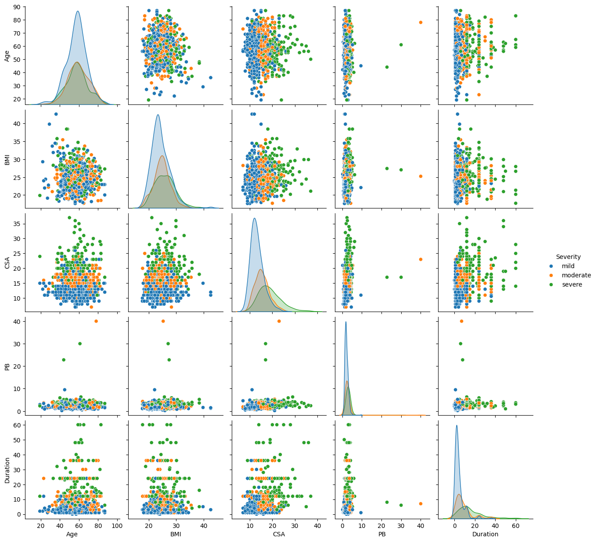

# Carpal Tunnel Severity Classification

This project focuses on classifying the severity of Carpal Tunnel Syndrome (CTS) using machine learning techniques. The objective is to develop a model that can accurately predict the severity level based on input features derived from clinical data.

## Project Overview

Carpal Tunnel Syndrome is a condition that causes pain, numbness, and tingling in the hand and arm. Early diagnosis and treatment can prevent long-term damage. This project aims to automate the classification process to assist healthcare professionals in diagnosing the severity of CTS.

### Key Steps:
- Data Preprocessing
- Feature Engineering
- Model Training
- Model Evaluation
- Results Interpretation

## Notebook Structure

The project is organized as follows:

1. **Introduction**: Brief overview of the problem statement and objectives.
2. **Data Import and Preprocessing**: 
   - Loading the dataset
   - Handling missing values
   - Normalizing and scaling features
3. **Exploratory Data Analysis (EDA)**: 
   - Visualizing the distribution of features
   - Analyzing correlations
4. **Feature Engineering**:
   - Feature selection
   - Creating new features based on domain knowledge
5. **Model Selection and Training**:
   - Evaluating different models (e.g., Logistic Regression, Random Forest, SVM, etc.)
   - Hyperparameter tuning using GridSearchCV
6. **Model Evaluation**:
   - Performance metrics such as accuracy, precision, recall, and F1-score
   - Confusion matrix
   - ROC-AUC curve
7. **Conclusion**:
   - Summary of results
   - Potential improvements
   - Future work

